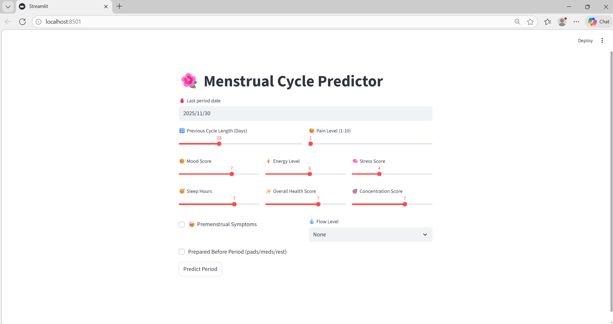
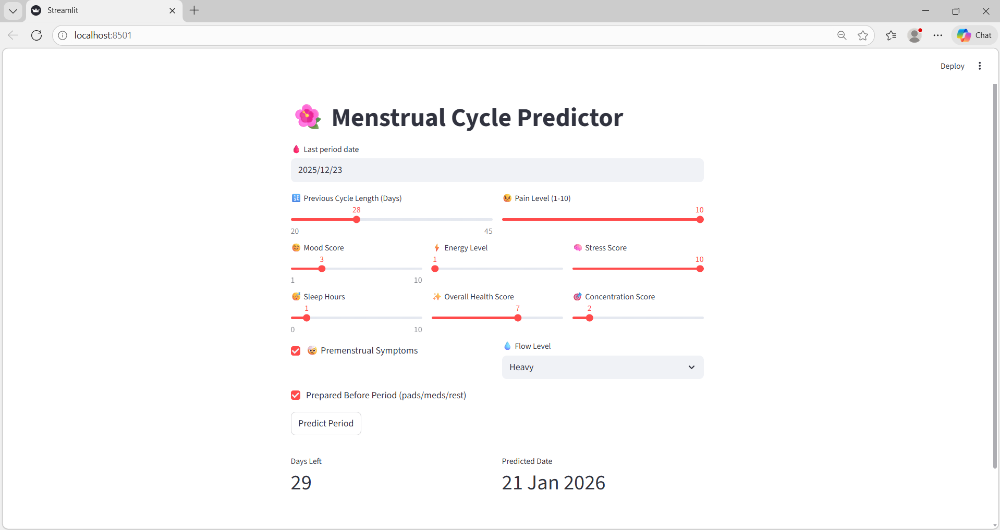

# 🌸 Menstrual Cycle Predictor

This is a **Period Prediction** web application built with **Streamlit**. It predicts the number of days left until your next period based on various inputs like **cycle length**, **mood**, **stress**, **sleep hours**, **pain level**, **PMS symptoms**, and more.

The app uses **machine learning models** (Random Forest and XGBoost) to predict the next period based on historical data and personal health information.

**Screenshots**
1. **App Input Page**:

   

2. **App Prediction Output**:

   

## Features:
- **Input Parameters**: 
  - Last period date
  - Previous cycle length
  - Pain level
  - Wellness scores (Mood, Energy, Stress, Health, Concentration)
  - Flow level (None, Light, Moderate, Heavy)
  - Premenstrual symptoms
  - Preparedness before period (Pads, meds, rest)

- **Predictions**:
  - Days left until the next period
  - Predicted date of the next period

## Models:
The app compares two different models for prediction:
1. **Random Forest Regression**
2. **XGBoost Regression**

The application uses **XGBoost model** for the final prediction.

## Requirements:
- Python 3.7+
- Streamlit
- Pandas
- Joblib
- Scikit-learn
- XGBoost

## Installation:

1. **Clone the repository** to your local machine:

   ```bash
   git clone https://github.com/sushmitamalakar10/menstrual-cycle-predictor.git

2. **Navigate to the project folder:**

   ```bash
   cd menstrual-cycle-predictor

3. **Set up a virtual environment:**

   ```bash
   python -m venv env

4. **Activate the virtual environment:**

   ```bash
   .\env\Scripts\Activate

5. **Install the required dependencies:** 

   ```bash
   pip install -r requirements.txt

You can install the required packages by installing the necessary libraries

```bash
pip install streamlit pandas joblib scikit-learn xgboost
